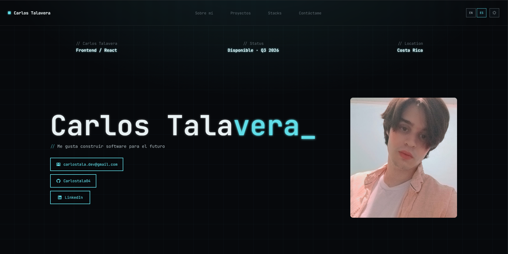

# Carlos Talavera — Portfolio

> Personal developer portfolio built with React. Fully responsive, bilingual (ES/EN), with dark/light theme and scroll-triggered animations.

---

## Live Demo

<!-- Replace with your actual deployment URL when you deploy -->
<!-- [carlostala.dev](https://carlostala.dev) -->

---

## Preview

<!-- Drop a screenshot here once the project is deployed -->
<!--  -->

---

## Features

- **Bilingual** — Spanish / English toggle with `i18next`, persisted in `localStorage`
- **Dark / Light theme** — CSS variable system, one-click toggle
- **Scroll animations** — Elements reveal on scroll via `IntersectionObserver`
- **Load animations** — Hero section animates on first paint
- **Responsive** — Mobile-first layout with hamburger menu
- **3D card flip** — Profile photo with hover flip effect
- **Contact section** — Visible on landing, no scroll required

---

## Tech Stack


---

## Project Structure

```text
src/
├── assets/
│   └── favicon/
│       ├── dark-mode-icon/     # Contact icons (dark theme)
│       ├── light-mode-icon/    # Contact icons (light theme)
│       └── tecnologies/        # Tech stack SVG icons
├── components/
│   ├── Button.jsx              # Reusable animated button / link
│   ├── CardProject.jsx         # Project card with image + tech badges
│   └── CardTechnology.jsx      # Tech group card with spinning border
├── data/
│   └── projects.js             # Projects data (title, repo, techs…)
├── hooks/
│   ├── calculateYearsExperience.js
│   ├── translation.js          # i18next config
│   └── useScrollReveal.js      # IntersectionObserver hook
├── locales/
│   ├── en.json                 # English translations
│   └── es.json                 # Spanish translations
├── sections/
│   ├── IntroBar.jsx            # Role / status / location bar
│   ├── HeroSection.jsx         # Name, tagline + contact buttons
│   ├── AboutSection.jsx        # Bio, stats, CV download
│   ├── TechnologiesSection.jsx # Skills grid
│   ├── ProjectsSection.jsx     # Project cards
│   └── FooterSection.jsx       # Quote + copyright
└── styles/                     # One CSS file per component
```

---

## Getting Started

### Prerequisites

- Node.js >= 18
- npm >= 9

### Install & run

```bash
# Clone the repo
git clone https://github.com/Carlostala04/Portafolio.git
cd Portafolio

# Install dependencies
npm install

# Start dev server
npm run dev
```

### Build for production

```bash
npm run build
```

Preview the production build locally:

```bash
npm run preview
```

---

## Theme System

All colors are CSS custom properties defined in `src/styles/App.css`. Switching themes overwrites the semantic tokens via `[data-theme="light"]`:

```css
/* Dark (default) */
--color-bg:     #07090c;
--color-accent: #5fdde8;

/* Light */
--color-bg:     #f0f2f1;
--color-accent: #2d7b89;
```

---

## i18n

Translations live in `src/locales/en.json` and `src/locales/es.json`. The active language is saved to `localStorage` under the key `"language"`.

To add a new language:

1. Create `src/locales/fr.json` mirroring the structure of `en.json`
2. Register it in `src/hooks/translation.js`
3. Add a button in `src/components/Header.jsx`

---

## Contact

| | |
| --- | --- |
| Email | [carlostala.dev@gmail.com](mailto:carlostala.dev@gmail.com) |
| LinkedIn | [linkedin.com/in/carlos-talavera](https://www.linkedin.com/in/carlos-talavera) |
| GitHub | [github.com/Carlostala04](https://github.com/Carlostala04) |

---

Built with React + Vite · © 2026 Carlos Talavera
